# CS 5990 (Advanced Data Mining) - Assignment #1

Bronco ID: 012143209

Last Name: Anunwah

First Name: Jeremy

## Question 1

 - a. This is not a data mining task, as it is simply dividing data via an already known attribute
 - b. This is not a data mining task, as only a small amount of data (real-time seismic wave measurements) are being monitored without prediction or analyses being performed
 - c. This is not a data mining task, as it can be done with basic arithmetic
 - d. This is not a data mining task, as it can be done with basic statistical formulas
 - e. This is a data mining task, as historical records are massive and the nuances of stock prices cannot be predicted with basic statistics
 - f. This is a data mining task, as abnormalities are not trivially apparent occurrences that may take significant data and computation to discover

## Question 2

 - a. Continuous, Ratio
 - b. Discrete, Ordinal
 - c. Continuous, Ratio
 - d. Discrete, Nominal
 - e. Discrete, Nominal

## Question 3

 - Visualization (Postprocessing): allows humans to interpret the results more easily
 - Dimensionality Reduction (Data Preprocessing): can greatly reduce the amount time and computational power required to complete an operation
 - Machine Learning (Data Mining): allows much  greater flexibility, thus providing more accuracy and data quality, in solving problems or discovering patterns as machines can teach themselves rather than depending on humans

## Question 4

 - a. Association Rule Mining: certain specific search terms can be considered synonymous or associated with other more common search terms
 - b. Anomaly Detection: given one search term, anomalies can represent an entirely unrelated term that should be discarded from results
 - c. Classification: keywords from webpages can be used to place the webpages into certain topics for filtering
 - d. Clustering: it can be easier to provide results by first identifying into which cluster the search query falls, then searching only for webpages within said cluster

## Question 5

 - a. The data scientists are most likely preparing to develop a model for prediciting if taxpayers' tax returns are fraudulent or legitimate
 - b. A feature is a characteristic of an object, e.g. Taxable Income in the dataset
 - c. A feature value is the number of symbol assigned to a feature of a particular object, e.g. 125K for the Taxable Income of the first object of the dataset
 - d. Dimensionality is the number of features in a dataset, e.g. 5 (number of columns in the dataset)
 - e. An instance is a collection of features, e.g. (1, Yes, Single, 125K, No) for the first instance in the dataset
 - f. A class is an attribute to which data scientists assign a label in a training dataset, which then becomes the discrete target variable of classification, e.g. Cheat in the dataset

## Question 6

Fields 2 and 3 can be represented by vectors x and y respectively. The cosine similarity of x and y is 1, thus the fields are similar.

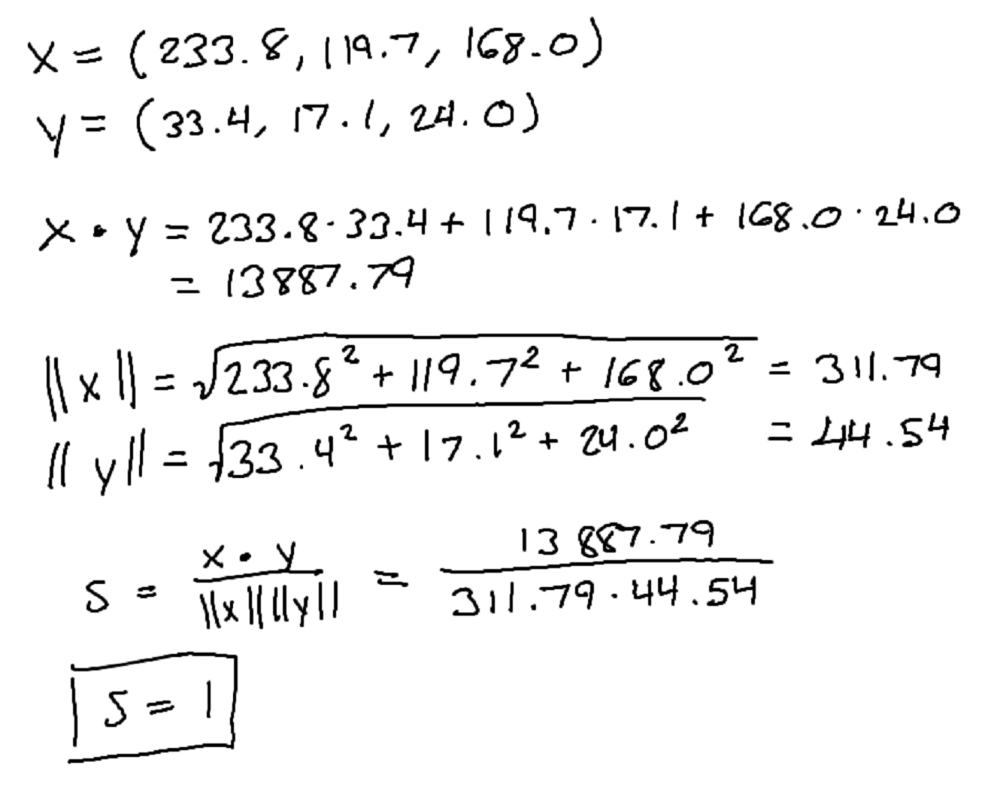

## Question 7a

Jaccard similarity = 0

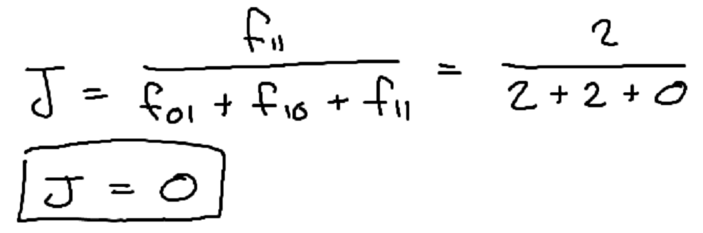

Cosine similarity = 0

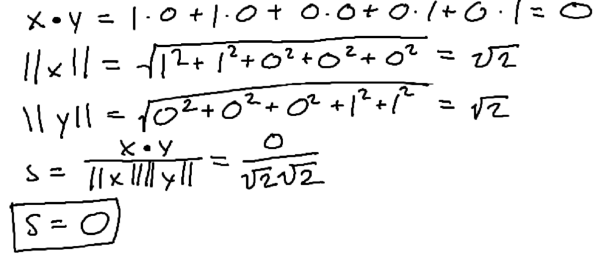

Euclidean distance = 2

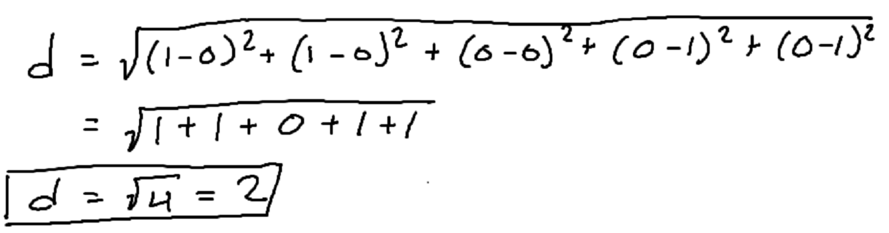

Correlation = -0.667

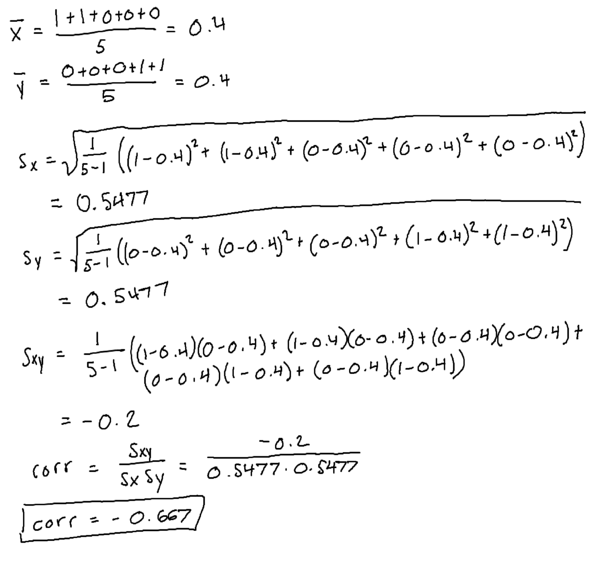

## Question 7b

Jaccard similarity = 0

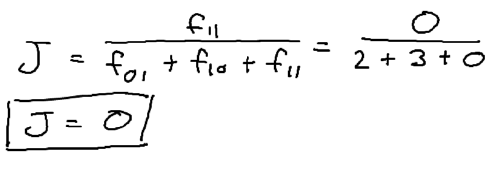

Cosine similarity = 0

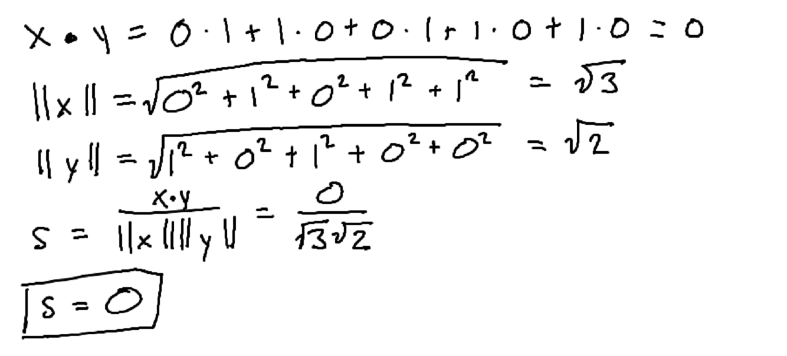

Euclidean distance = √5

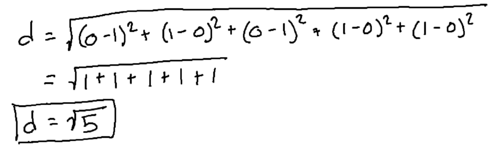

Correlation = -1

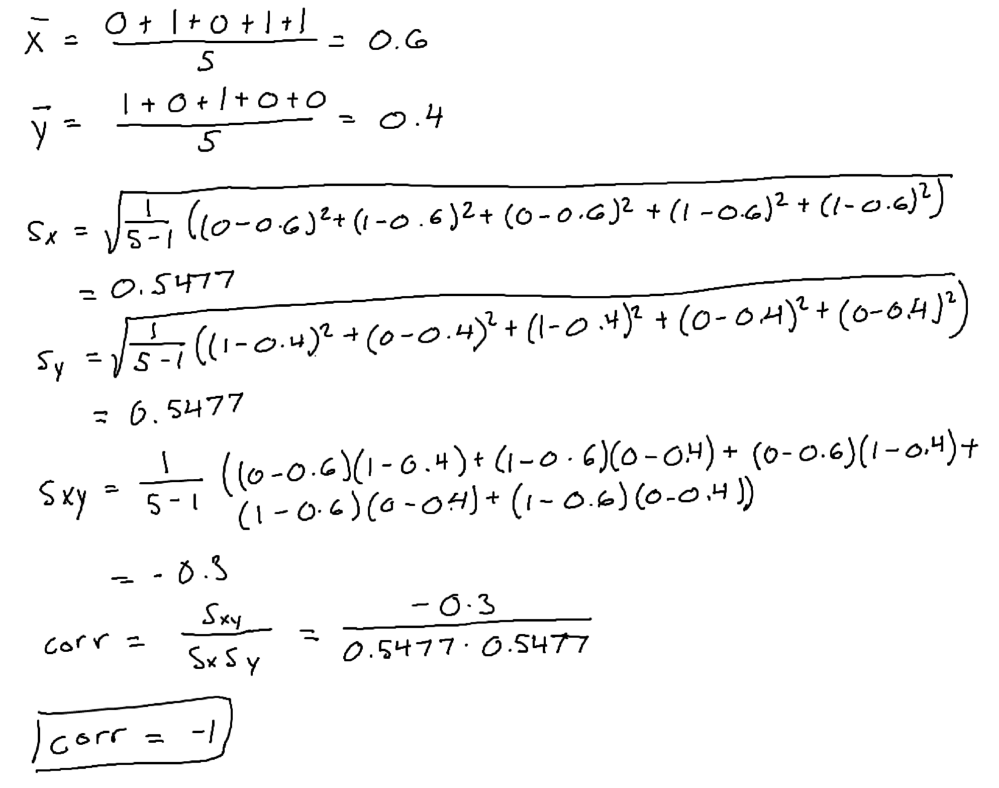

## Question 8a

u and v are perpendicular if their dot product is zero, thus k = 3

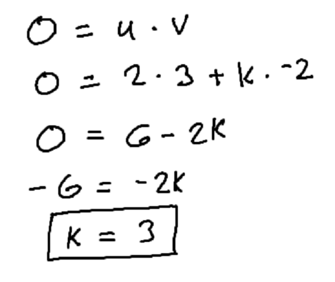

## Question 8b

u and v are parallel if they are scalar multiples of each other, thus k = -4/3

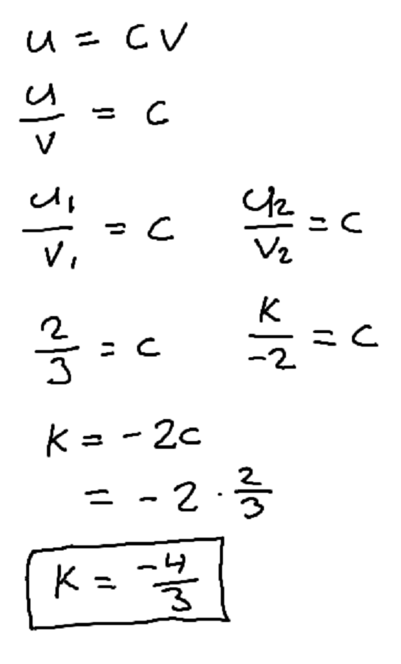

## Question 9

 - a. Aggregation: objects were grouped based on the item category, and prices were summed
 - b. Feature Selection: only Item, Date, and Price were kept from the originial dataset
 - c. Normalization: the prices were adjusted
 - d. Sampling: only a subset of objects were selected from the dataset

## Question 10

See https://github.com/jcanundroid/spring-2024-cs-5990-01
