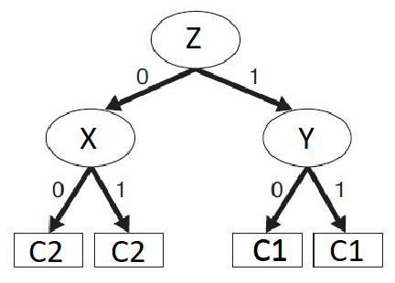
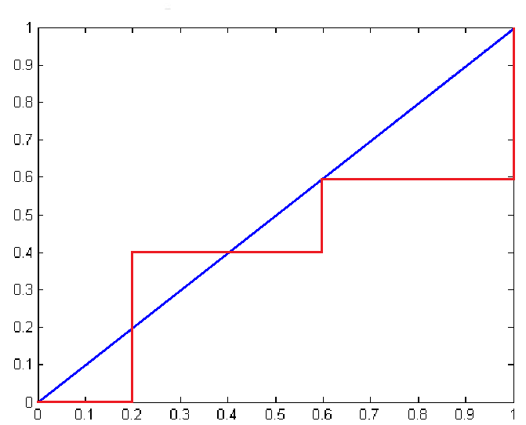
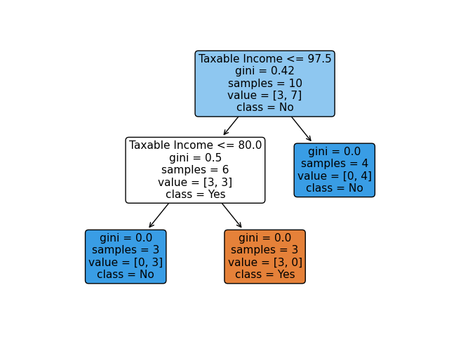
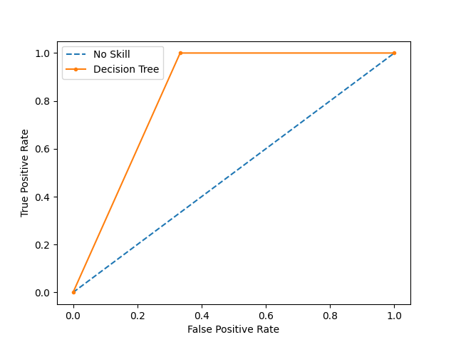

# CS 5990 (Advanced Data Mining) - Assignment #2

Bronco ID: 012143209

Last Name: Anunwah

First Name: Jeremy

## Question 1

 - a. The entropy = `-(5 / 9) * log2(5 / 9) - (4 / 9) * log2(4 / 9)` = `0.99`
 - b. The information gain of a1 = `0.99 - 0.76` = `0.23`; the information gain of a2 = `0.99 - 0.98` = `0.01`
   - branch entropies:
     - a1 left branch (a1 = F): `-(4 / 5) * log2(4 / 5) - (1 / 5) * log2(1 / 5)` = `0.72`
     - a1 right branch (a1 = T): `-(1 / 4) * log2(1 / 4) - (3 / 4) * log2(3 / 4)` = `0.81`
     - a2 left branch (a1 = F): `-(2 / 4) * log2(2 / 4) - (2 / 4) * log2(2 / 4)` = `1.00`
     - a2 right branch (a1 = T): `-(3 / 5) * log2(3 / 5) - (2 / 5) * log2(2 / 5)` = `0.97`
   - weighted entropies:
     - a1: `(5 / 9) * 0.72 + (4 / 9) * 0.81` = `0.76`
	 - a2: `(4 / 9) * 1.00 + (5 / 9) * 0.97` = `0.98`
 - d. The best split is a1 according to the information gain
 - e. The best split is a1 according to the gain ratio
   - split info:
     - a1 and a2: `-(5 / 9) * log2(5 / 9) - (4 / 9) * log2(4 / 9)` = `0.99`
   - gain ratios:
     - a1: `0.23 / 0.99` = `0.2323`
	 - a2: `0.01 / 0.99` = `0.0101`
 - f. The best split is a1 according to the GINI indices
   - GINI indices:
     - a1 left branch (a1 = F): `1 - (4 / 5) ^ 2 - (1 / 5) ^ 2` = `0.32`
     - a1 right branch (a1 = T): `1 - (1 / 4) ^ 2 - (3 / 4) ^ 2` = `0.37`
     - a2 left branch (a1 = F): `1 - (2 / 4) ^ 2 - (2 / 4) ^ 2` = `0.50`
     - a2 right branch (a1 = T): `1 - (3 / 5) ^ 2 - (2 / 5) ^ 2` = `0.48`
   - weighted GINI indices:
     - a1: `(5 / 9) * 0.32 + (4 / 9) * 0.37` = `0.342`
	 - a2: `(4 / 9) * 0.50 + (5 / 9) * 0.48` = `0.488`
 - g. The best split is a1 according to the classification error rate
   - branch classification error rates:
     - a1: `(1 + 1) / 9` = `2 / 9`
	 - a2: `(2 + 2) / 9` = `4 / 9`

## Question 2

### Part A

#### Computing the Root Node

Number of incoming instances: `5 + 0 + 10 + 45 + 10 + 25 + 5 + 0 40 + 15 + 5 + 0 + 5 + 0 + 20 + 15` = `200`

Splitting on X:
 - left branch (X = 0):
   - C1 #: `5 + 0 + 10 + 45` = `60` (minority)
   - C2 #: `40 + 15 + 5 + 0` = `60`
 - right branch (X = 1):
   - C1 #: `10 + 25 + 5 + 0` = `40` (minority)
   - C2 #: `5 + 0 + 20 + 15` = `40`
 - error: `(60 + 40) / 200` = `0.5`

Splitting on Y:
 - left branch (Y = 0):
   - C1 #: `5 + 0 + 10 + 25` = `40` (minority)
   - C2 #: `40 + 15 + 5 + 0` = `60`
 - right branch (Y = 1):
   - C1 #: `10 + 45 + 5 + 0` = `60`
   - C2 #: `5 + 0 + 20 + 15` = `40` (minority)
 - error: `(40 + 40) / 200` = `0.4`

Splitting on Z:
 - left branch (Z = 0):
   - C1 #: `5 + 10 + 10 + 5` = `30` (minority)
   - C2 #: `40 + 5 + 5 + 20` = `70`
 - right branch (Z = 1):
   - C1 #: `0 + 45 + 25 + 0` = `70`
   - C2 #: `15 + 0 + 0 + 15` = `30` (minority)
 - error: `(30 + 30) / 200` = `0.3`

Selecting Z as the root node yields the lowest error of `0.3`

#### Computing the Left Child Node (Z = 0)

Number of incoming instances: `5 + 10 + 10 + 5 + 40 + 5 + 5 + 20` = `100`

Splitting on X:
 - left branch (X = 0):
   - C1 #: `5 + 10` = `15` (minority)
   - C2 #: `40 + 5` = `45`
 - right branch (X = 1):
   - C1 #: `10 + 5` = `15` (minority)
   - C2 #: `5 + 20` = `25`
 - error: `(15 + 15) / (100)` = `0.3`

Splitting on Y:
 - left branch (Y = 0):
   - C1 #: `5 + 10` = `15` (minority)
   - C2 #: `40 + 5` = `45`
 - right branch (Y = 1):
   - C1 #: `10 + 5` = `15` (minority)
   - C2 #: `5 + 20` = `25`
 - error: `(15 + 15) / (100)` = `0.3`

Selecting X and Y yields the same error; we choose X at random

#### Computing the Left Child Node (Z = 1)

Number of incoming instances: `0 + 45 + 25 + 0 + 15 + 0 + 0 + 15` = `100`

Splitting on X:
- left branch (X = 0):
  - C1 #: `0 + 45` = `45`
  - C2 #: `15 + 0` = `15` (minority)
- right branch (X = 1):
  - C1 #: `25 + 0` = `25`
  - C2 #: `0 + 15` = `15` (minority)
- error: `(15 + 15) / (100)` = `0.3`

Splitting on Y:
- left branch (Y = 0):
  - C1 #: `0 + 25` = `25`
  - C2 #: `15 + 0` = `15` (minority)
- right branch (Y = 1):
  - C1 #: `45 + 0` = `45`
  - C2 #: `0 + 15` = `15` (minority)
- error: `(15 + 15) / (100)` = `0.3`

Selecting X and Y yields the same error; we choose Y at random

#### Final Tree

#### Part B

Using the tree from, we check each instance according to its features:

X|Y|Z|C1 #|C2 #|Errors
:---:|:---:|:---:|:---:|:---:|:---:
0|0|0|5|40|5
0|0|1|0|15|15
0|1|0|10|5|10
0|1|1|45|0|0
1|0|0|10|5|10
1|0|1|25|0|0
1|1|0|5|20|5
1|1|1|0|15|15

Thus, the overall error rate is `(5 + 15 + 10 + 0 + 10 + 0 + 5 + 15) / 200` = `0.3`

## Question 3

Training Set Predictions:

Instance|Class|Prediction|Correct?
:---:|:---:|:---:|:---:
1|+|+|Yes
2|+|+|Yes
3|+|-|No
4|-|-|Yes
5|+|+|Yes
6|+|+|Yes
7|-|+|No
8|+|-|No
9|-|+|No
10|-|+|No

Validation Set Predictions:

Instance|Class|Prediction|Correct?
:---:|:---:|:---:|:---:
11|+|+|Yes
12|+|-|No
13|+|+|Yes
14|-|-|Yes
15|+|+|Yes

Test Set Predictions:

Instance|Class|Prediction|Correct?
:---:|:---:|:---:|:---:
16|+|-|No
17|+|+|Yes
18|-|-|Yes
19|+|-|No
20|-|-|Yes
21|-|+|No
22|+|+|Yes
23|+|+|Yes

 - a. Of the 10 instances in the training set, the model incorrectly classified 5 instances, thus the optimistic error estimate is `5/10` = `0.5`
 - b. Using the optimistic error estimate of `0.5`, the pessimistic error estimate is `0.5 + 0.5 * 4 / 10` = `0.7`
 - c. Of the 5 instances in the validation set, the model incorrectly classified 1 instance, thus the generalization error rate is `1/5` = `0.2`
 - d. Based on the cases below, the accuracy of the model is `(3 + 2) / (3 + 2 + 1 + 2)` = `0.625`
   - True Positive (3): 17, 22, 23
   - True Negative (2): 18, 20
   - False Positive (1): 21
   - False Negative (2): 16, 19
 - e. The precision, recall, and F1-measure are:
   - Precision: `3 / (3 + 1)` = `0.75`
   - Recall: `3 / (3 + 2)` = `0.60`
   - F1-measure: `2 * 0.60 * 0.75 / (0.60 + 0.75)` = `0.66`

## Question 4

Sorted instances:

Instance|True Class|P(+\|A)
:---:|:---:|---:
3|-|0.68
1|+|0.61
5|+|0.45
7|-|0.38
4|-|0.31
6|+|0.09
8|-|0.05
10|-|0.04
2|+|0.03
9|+|0.01

ROC Table:

Class|+|+|-|-|+|-|-|+|+|-||
:---:|:---:|:---:|:---:|:---:|:---:|:---:|:---:|:---:|:---:|:---:|:---:|
|0.01|0.03|0.04|0.05|0.09|0.31|0.38|0.45|0.61|0.68|1.00
TP|5|4|3|3|3|2|2|2|1|0|0
FP|5|5|5|4|3|3|2|1|1|1|0
TN|0|0|0|1|2|2|3|4|4|4|5
FN|0|1|2|2|2|3|3|3|4|5|5
TPR|1.0|0.8|0.6|0.6|0.6|0.4|0.4|0.4|0.2|0.0|0.0
FPR|1.0|1.0|1.0|0.8|0.6|0.6|0.4|0.2|0.2|0.2|0.0

Plot:

## Question 5

Below is an example of the decision tree developed by the program:

See https://github.com/jcanundroid/spring-2024-cs-5990-01

## Question 6

Below is an example of the ROC curve plotted by the program:

See https://github.com/jcanundroid/spring-2024-cs-5990-01
